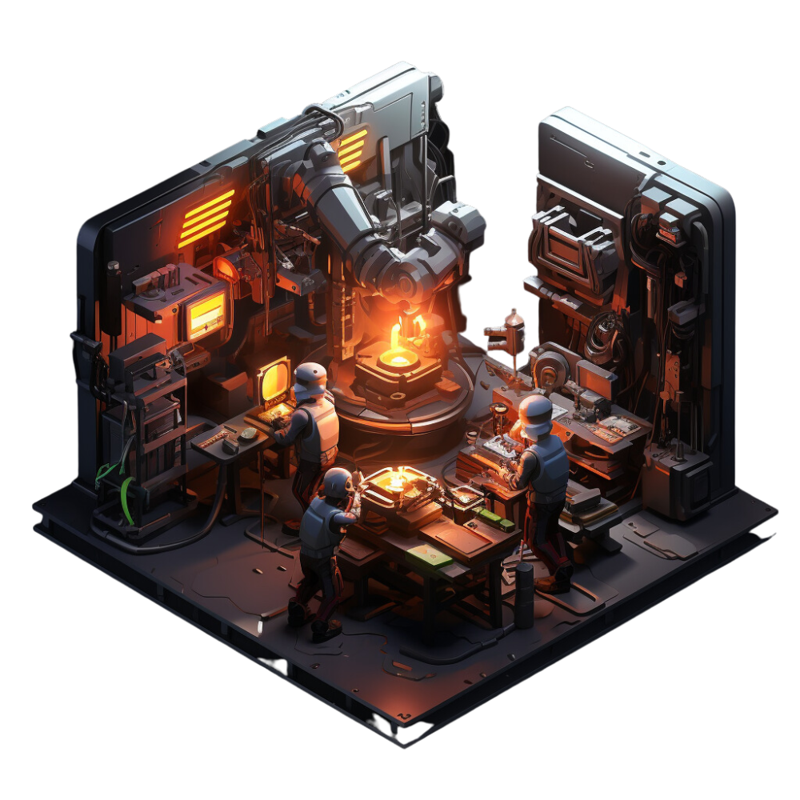

# dot-files

### 👋 Welcome!

This repository contains the dot-files for my Arch Linux
configuration.

***Currently undergoing construction 🏗️***

<picture>
    <source
        media="(prefers-color-scheme: dark)"
        srcset="./images/construction.png"
    >
    <source
        media="(prefers-color-scheme: light)"
        srcset="./images/construction.png"
    >
    
</picture>

---

### References
💾 Config
- OS: [Arch Linux](https://archlinux.org/)
- Window Manager: [i3](https://github.com/i3/i3)
- Shell: [zsh](https://www.zsh.org/)
- Terminal: [kitty](https://sw.kovidgoyal.net/kitty/)
- Font: [JetBrains Mono](https://www.jetbrains.com/lp/mono/)
- Compositor: [picom](https://github.com/yshui/picom)

🎨 Themes / Colorschemes
- [Dracula](https://draculatheme.com/)
    - [Dunst](https://github.com/dracula/dunst)
- [Nord](https://www.nordtheme.com/)
    - [NeoVim](https://github.com/shaunsingh/nord.nvim)
