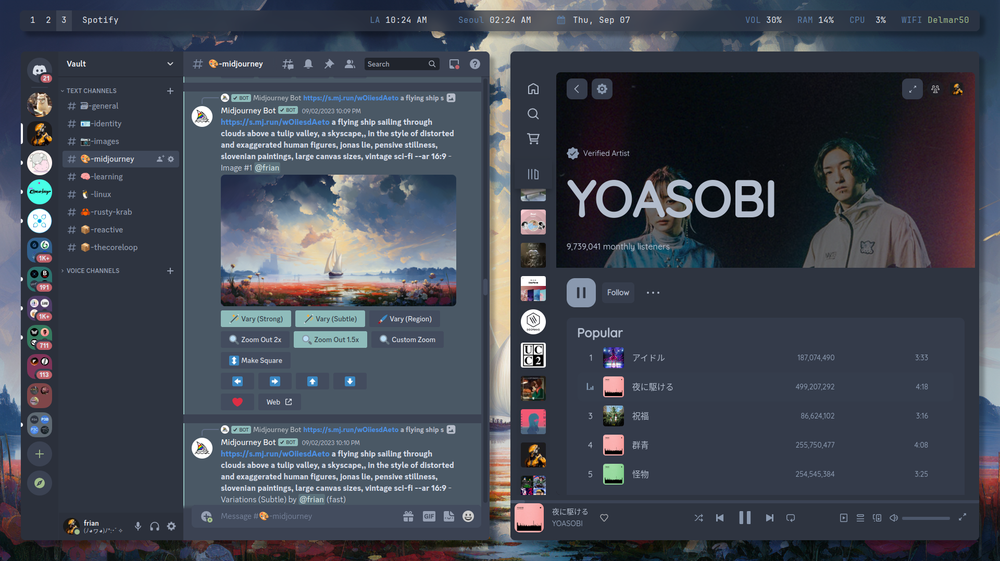

# 🧠 smexy dots 💅 
***smart 'n' sexy dot-files***

#### About Me
Just a newbie developer who yolo'd into Arch Linux and loves to kill
time configuring dot-files.

This repository is my attempt at sharing my dot-files with those who
are interested.

---

### Nord Theme
Check out [Nord](https://www.nordtheme.com/)-themed dot-files [here](/nord/)

<picture>
    
</picture>
<picture>
    
</picture>

---

### Gruvbox
*Currently working on [Gruvbox](https://github.com/morhetz/gruvbox)-themed version of these dot-files*

---

### References
💾 Config
- OS: [Arch Linux](https://archlinux.org/)
- Terminal: [kitty](https://sw.kovidgoyal.net/kitty/)
- Shell: [zsh](https://www.zsh.org/)
- Window Manager: [i3](https://github.com/i3/i3)
- Compositor: [picom](https://github.com/yshui/picom)
- Font: [JetBrains Mono](https://www.jetbrains.com/lp/mono/)

🎨 Themes
- [Nord](https://www.nordtheme.com/)
    - [NeoVim](https://github.com/shaunsingh/nord.nvim)
    - [Nordzy Icons](https://github.com/alvatip/Nordzy-icon)
    - [Nordzy Cursors](https://github.com/alvatip/Nordzy-cursors)
