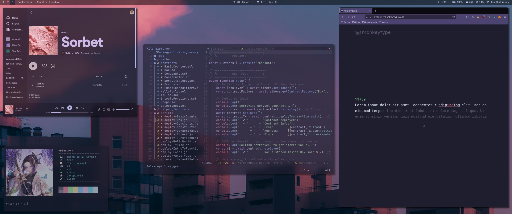

# dot-files

### Dot Files for my Arch Linux Configuration

*heavily inspired by Catppuccin theme*

### Credits/References
* Window Manager - [Airblader/i3-gaps](https://github.com/Airblader/i3)
* Compositor - [ibhagwan/picom](https://github.com/ibhagwan/picom)
* Theme - [Catppuccin](https://github.com/catppuccin/catppuccin)
* Terminal - [kitty](https://github.com/kovidgoyal/kitty), [alacritty](https://github.com/alacritty/alacritty)
* Shell - [zsh](https://github.com/ohmyzsh/ohmyzsh/wiki)
* Text Editor - [NeoVim](https://github.com/neovim/neovim)
* Status Bar - [polybar](https://github.com/polybar/polybar)
* Notifications - [dunst](https://github.com/dunst-project/dunst)
* Images
    * Shinobu Kocho Fan Art by [@ebkim00](https://twitter.com/ebkim00?lang=en)
    * [catppuccin wallpapers](https://github.com/catppuccin/wallpapers)
* Misc
    * [catppuccin alacritty](https://github.com/catppuccin/alacritty)
    * [catppuccin kitty](https://github.com/catppuccin/kitty)
    * [catppuccin neovim](https://github.com/catppuccin/nvim)
    * [cattpuccin rofi](https://github.com/catppuccin/rofi)
    * [catppuccin grub](https://github.com/catppuccin/grub)
    * [cattpuccin BetterDiscord](https://github.com/catppuccin/discord)
    * [catppuccin spicetify](https://github.com/catppuccin/spicetify)
    * [catppuccin dunst](https://github.com/catppuccin/catppuccin)

